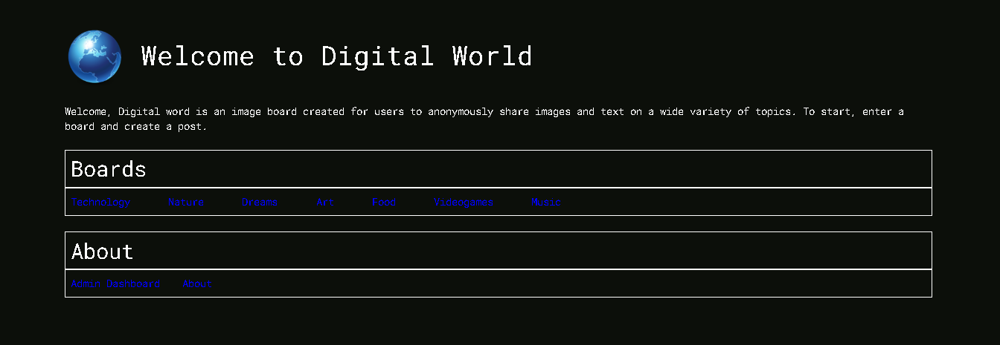
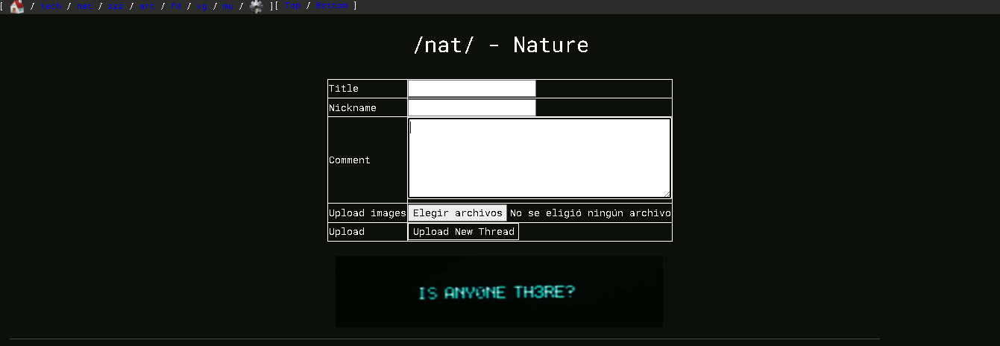
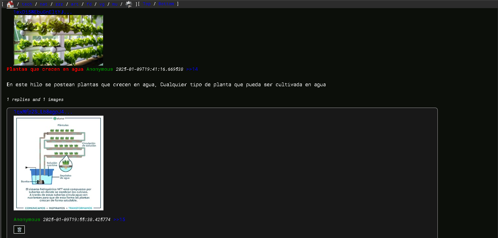
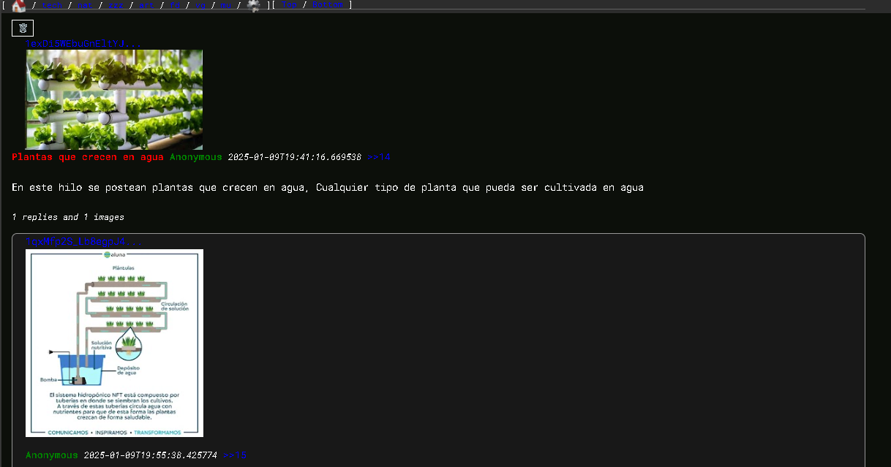
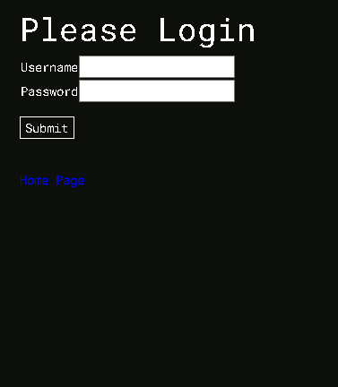
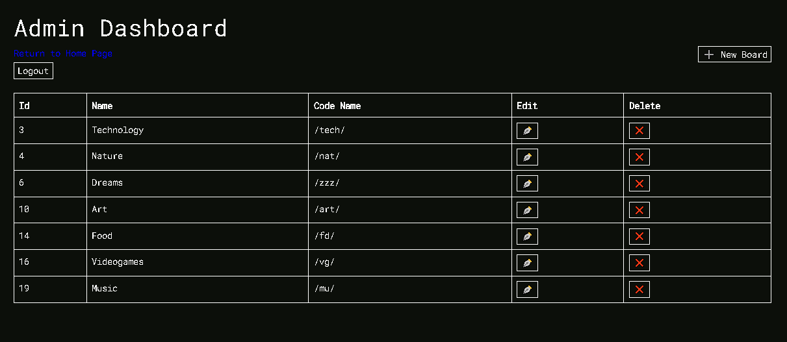
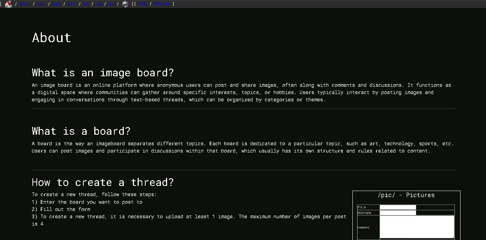

# Imageboard-w-SpringBoot

## Descrpition
Welcome to **Digital World**, an imageboard created to share anonymously with other users on various topics. This project started with the purpose of improving my skills in Spring boot, in each iteration this project slowly became an interesting tool that could create digital communities. An image board is a type of online forum where users post images, often along with text and discussion. The first image boards were created in Japan and were based on the textboard concept.

As the nature of an imageboard is that users can upload images, this project handles saving and displaying images using the Google Drive API for storing images. To test the deployment of the application, the Render service was used to run a web service connected to the PostgreSQL database.

## Features


Some of the main functions of this project are:
- **Image posting**: Users can create new posts with images in JPEG, PNG, GIF, etc. Support for animated images (GIFs).
- **Comments and replies**: Users can reply to posts with comments.
Threaded reply system, where comments can be nested (sub-replies).
Tags or categories.Ability to create posts in different "boards" or "categories" (e.g. Art, Games, Technology, Pop Culture, etc.) Filter posts by category.
- **Anonymous uploading**: Users can post and comment completely anonymously, without creating an account.
- **Post pagination**: Newest posts appear at the top. Navigation between multiple pages of posts, with automatic pagination.
- **Post deletion**: Admin users can delete images and comments.

## Technologies
Technologies used to create this project are:
- **Frontend**: HTML, CSS, Thymeleaf, Bootstrap
- **Backend**: Java 17, Spring boot 3 Maven 
- **Database** - PostgreSQL
- **Image storage**: Google Cloud, Google Drive API
- **Authentication**: Spring Security

## Installation and Setup
### Prerequisites
To try this application in the IDE it is necessary that the following prerequisites are met:

- JDK Installed: <a href="https://www.oracle.com/java/technologies/javase/jdk17-archive-downloads.html">Install JDK 17</a>
- Maven Instaled: <a href="https://maven.apache.org/download.cgi">Install Maven</a>
- PostgreSQL Instaled: <a href="https://www.postgresql.org/download/
">Install PostgreSQL</a>
- Have installed an IDE. Recommended: IntelliJ IDEA, Eclipse, Visual Studio Code

### Installation
Open git bash and run the following command to clone the respository:
   ```bash
   git clone https://github.com/ItzakSanchez/Imageboard-w-SpringBoot.git
   ```
Once the cloning process is complete, open the folder with an IDE
   
### Setup
Setting up Google Drive API: 
- Create a Google project at: <a href="https://console.cloud.google.com/">Google Cloud</a>
- Enable Google Drive API
- Create a Google service account
- Create a new Google Drive folder.
- Grant full access to the newly created service account.
- Change the access so that everyone can see the folder and its content
- With the newly created service account, create a service account key in JSON format
- Rename the .json file to the exact name "credentials.json" and place it right inside the `/src/main/resources/` folder

### Lauching

Setting enviroment variables: In order to run the program correctly, you need to provide the following environment variables when running the program. Each of them is mandatory for the correct operation of the program. Setting environment variables varies between each IDE.

- `postgres.database` -> The url of the database e.g. (jdbc:postgresql://localhost:5432/test)
- `postgres.username` -> The username of the database
- `postgres.password` -> The password of the database
- `spring.security.user.name` -> The new username of the admin to manage the imageboard
- `spring.security.user.password` -> The password of the admin account to manage the imageboard
- `drive.folder.id` -> The id of the drive folder wher the images will be sabed

Lauching the application: After setting the environment variables, run the application through the "Run and Debug" function of the IDE.

After waiting about 30 seconds, the following message should appear: `Tomcat started on port 8080`

### Usage

If it is the first time the program is run. There will be no board to show. To add a new board, access the "Admin Dashboard" section, -> "Add new Board" and add the name and Code name of the Board. Now it is possible to access the new board, create new Threads and reply to them.

To create a new thread follow these steps:

- Access the board where you want to create the thread
- Fill out the form at the top, all fields are necessary except the nickname, it is also necessary to upload at least 1 image when creating a new thread
- Click submit to create the new one

## Project Structure
```
src/
| main
| | java/ 
| | | - Java Source code
| | resources/
| | | static/
| | | | css/
| | | | images/
| | | | | icons/
| | | | | pictures/
| | | templates/
| | | | error/
| | | | | error.html - error templates
| | | | templates.html - Thymeleaf templates 
| | | SQL/
| | | | schema.sql
| | | credentials.json - Credentials for Google Drive API
| | | application.propperties
pom.xml - Project dependencies and configurations 
```
## Authors and Acknowledgments
Designed and developed by Edgar Itzak Sanchez Rogers

## Project Status
**Archived**

This project has been archived and no further updates or improvements are planned. The code is kept as is for reference or use in personal projects. No new contributions will be accepted and no changes will be made.
## Screenshots









## Contact
My email: edgaritzak@outlook.com
